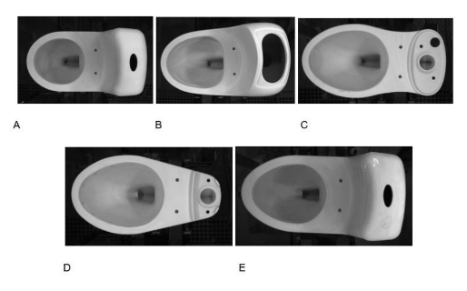

# Clasificador de sanitarios cerámicos usando Redes Convolucionales y Keras

Vamos a implementar una red convolucional para clasificar 5 tipos de sanitarios, los cuales corresponden a cierta referencia: referenciaA, referenciaB, referenciaC, referenciaD y referenciaE. Esto con el fin de facilitar el etiquetado de cada sanitario a la hora de su producción. 
El Dataset a emplear consta de 42 imágenes que se encuentran el directorio: ImagenesExamenCeramicos


<div style="text-align:center"></div>


## Dependencias 

* numpy==1.16.4
* matplotlib==3.1.0
* Keras==2.4.3
* tensorflow==2.3.1

## instalar dependencias 
```
pip install requirements.txt
```